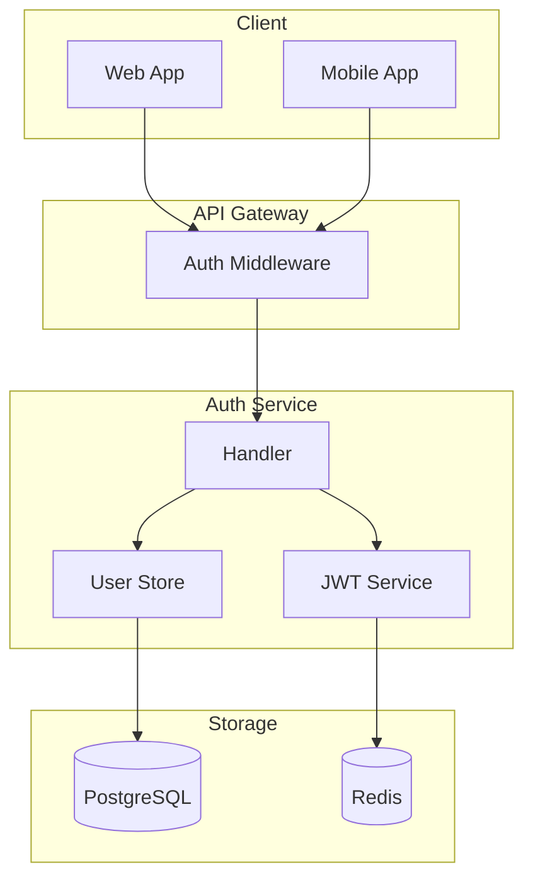
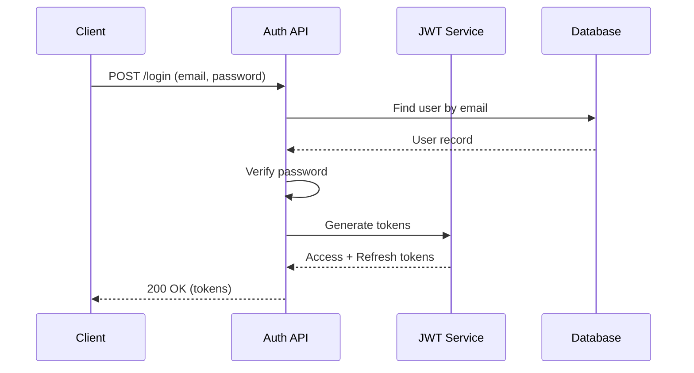

# Phase 5: Auto Docs Generator Skill

> 구현 완료 후 자동 문서화

## 목적

구현이 완료된 기능에 대해 자동으로 API 문서, 변경 로그, 아키텍처 다이어그램 등을
생성하여 문서화 부담을 줄이고 일관성을 유지합니다.

## 사용 시나리오

```bash
# 특정 기능 문서 생성
> /generate-docs user-auth

# API 문서만 생성
> /generate-docs user-auth --api-only

# CHANGELOG 업데이트
> /generate-docs --changelog

# 전체 문서 재생성
> /generate-docs --all
```

## 생성 문서 종류

### 1. API 문서 (API Documentation)

```yaml
source: 코드에서 추출
  - HTTP 핸들러 함수
  - OpenAPI/Swagger 어노테이션
  - 요청/응답 타입 정의

output: docs/api/{feature}/README.md
```

**예시 출력:**

```markdown
# User Auth API

## Endpoints

### POST /api/auth/signup

회원가입 API

**Request Body:**
```json
{
  "email": "user@example.com",
  "password": "securePassword123"
}
```

**Response:**
```json
{
  "id": 1,
  "email": "user@example.com",
  "created_at": "2024-01-15T10:00:00Z"
}
```

**Error Codes:**
| Code | Description |
|------|-------------|
| 400 | Invalid email format |
| 409 | Email already exists |

---

### POST /api/auth/login
...
```

### 2. 변경 로그 (CHANGELOG)

```yaml
source:
  - Git 커밋 히스토리
  - 설계 문서 (00_OVERVIEW.md)
  - PR 설명

output: CHANGELOG.md (기존 파일에 추가)
```

**예시 출력:**

```markdown
## [Unreleased]

### Added
- User authentication system with JWT tokens
  - Signup endpoint (`POST /api/auth/signup`)
  - Login endpoint (`POST /api/auth/login`)
  - Token refresh endpoint (`POST /api/auth/refresh`)
- Session management with Redis

### Changed
- Updated database schema with users table

### Security
- Implemented bcrypt password hashing
- Added rate limiting for auth endpoints
```

### 3. 아키텍처 다이어그램 (Architecture Diagram)

```yaml
source:
  - 설계 문서 (System Architecture 섹션)
  - 코드 구조 분석

output: docs/architecture/{feature}.md (Mermaid 다이어그램)
```

**예시 출력:**

```markdown
# User Auth Architecture

## Component Diagram



## Sequence Diagram - Login Flow


```

### 4. 타입/모델 문서 (Type Documentation)

```yaml
source:
  - Go struct, TypeScript interface
  - 데이터베이스 스키마

output: docs/models/{feature}.md
```

**예시 출력:**

```markdown
# User Auth Models

## User

| Field | Type | Description |
|-------|------|-------------|
| id | int64 | Primary key |
| email | string | Unique email address |
| password_hash | string | Bcrypt hashed password |
| created_at | time.Time | Creation timestamp |
| updated_at | time.Time | Last update timestamp |

## Session

| Field | Type | Description |
|-------|------|-------------|
| id | int64 | Primary key |
| user_id | int64 | Foreign key to users |
| refresh_token | string | JWT refresh token |
| expires_at | time.Time | Token expiration |
```

### 5. 사용 가이드 (Usage Guide)

```yaml
source:
  - 설계 문서
  - API 문서
  - 코드 예제

output: docs/guides/{feature}.md
```

**예시 출력:**

```markdown
# User Auth Usage Guide

## Quick Start

### 1. Sign Up

```bash
curl -X POST http://localhost:8080/api/auth/signup \
  -H "Content-Type: application/json" \
  -d '{"email": "user@example.com", "password": "secure123"}'
```

### 2. Login

```bash
curl -X POST http://localhost:8080/api/auth/login \
  -H "Content-Type: application/json" \
  -d '{"email": "user@example.com", "password": "secure123"}'
```

Response:
```json
{
  "access_token": "eyJhbG...",
  "refresh_token": "eyJhbG...",
  "expires_in": 900
}
```

### 3. Use Access Token

```bash
curl http://localhost:8080/api/protected \
  -H "Authorization: Bearer eyJhbG..."
```
```

## 파일 구조

```
skills/generate-docs/
├── SKILL.md              # Skill 정의
├── config.yaml           # 생성 설정
├── extractors/
│   ├── api.md            # API 추출 가이드
│   ├── types.md          # 타입 추출 가이드
│   └── changelog.md      # 변경 로그 규칙
└── templates/
    ├── api.md            # API 문서 템플릿
    ├── changelog.md      # CHANGELOG 템플릿
    ├── architecture.md   # 아키텍처 템플릿
    ├── models.md         # 모델 문서 템플릿
    └── guide.md          # 가이드 템플릿
```

## config.yaml 스키마

```yaml
# generate-docs skill 설정

output:
  base_path: "docs"
  api_path: "docs/api"
  architecture_path: "docs/architecture"
  guides_path: "docs/guides"
  models_path: "docs/models"

generators:
  api:
    enabled: true
    format: "markdown"      # markdown | openapi
    include_examples: true
    include_errors: true

  changelog:
    enabled: true
    format: "keepachangelog"  # keepachangelog | conventional
    auto_categorize: true     # Added, Changed, Fixed 자동 분류

  architecture:
    enabled: true
    diagram_format: "mermaid"
    include_sequence: true
    include_component: true

  models:
    enabled: true
    include_validation: true
    include_examples: true

  guide:
    enabled: true
    include_curl: true
    include_sdk: false        # SDK 예제 포함 여부

# 언어별 설정
language:
  go:
    handler_pattern: "func.*Handler.*http.ResponseWriter"
    struct_pattern: "type\\s+(\\w+)\\s+struct"
  typescript:
    handler_pattern: "export.*async.*Request.*Response"
    interface_pattern: "export interface"

# 소스 경로
sources:
  code: "internal"
  plans: "docs/plans"
```

## SKILL.md 정의

```yaml
---
name: generate-docs
description: Generate API docs, changelog, architecture diagrams from code
allowed-tools: Read, Write, Glob, Grep, Bash, Task
---
```

## 실행 흐름

```
┌─────────────────┐
│ /generate-docs  │
│   user-auth     │
└────────┬────────┘
         │
         ▼
┌─────────────────┐
│ 1. 소스 분석    │
│ - 설계 문서     │
│ - 구현 코드     │
│ - Git 히스토리  │
└────────┬────────┘
         │
         ▼
┌─────────────────┐
│ 2. 정보 추출    │
│ - API 엔드포인트│
│ - 타입/모델     │
│ - 변경 사항     │
└────────┬────────┘
         │
         ▼
┌─────────────────┐
│ 3. 템플릿 적용  │
│ - 문서 생성     │
│ - 다이어그램    │
└────────┬────────┘
         │
         ▼
┌─────────────────┐
│ 4. 파일 출력    │
│ - docs/api/     │
│ - CHANGELOG.md  │
│ - docs/arch/    │
└─────────────────┘
```

## 출력 예시

```
## 📚 Documentation Generated

### user-auth Feature

📁 Generated Files:
├── docs/api/user-auth/README.md          ✓ API Documentation
├── docs/architecture/user-auth.md        ✓ Architecture Diagrams
├── docs/models/user-auth.md              ✓ Data Models
├── docs/guides/user-auth.md              ✓ Usage Guide
└── CHANGELOG.md                          ✓ Updated

### Summary
- 4 API endpoints documented
- 3 data models documented
- 2 architecture diagrams generated
- 1 changelog entry added

### Preview

#### API Endpoints
- POST /api/auth/signup
- POST /api/auth/login
- POST /api/auth/refresh
- POST /api/auth/logout

#### New Changelog Entry
```
## [1.2.0] - 2024-01-18
### Added
- User authentication system with JWT
```
```

## 워크플로우 연동

```
/plan-feature     /init-impl      개발          /review        /generate-docs
     │                │             │              │                 │
     │                │             │              │                 │
     ▼                ▼             ▼              ▼                 ▼
  설계 문서    →    체크리스트  →  코드 작성  →  품질 검토  →   문서 자동 생성
     │                                                              │
     └──────────────────────────────────────────────────────────────┘
                        문서 ↔ 코드 일관성 유지
```

## 확장 가능성

- **OpenAPI 출력**: Swagger UI 호환 문서 생성
- **SDK 생성**: API 문서에서 SDK 코드 자동 생성
- **다국어 지원**: 문서 자동 번역
- **버전 관리**: API 버전별 문서 유지
- **변경 감지**: 코드 변경 시 문서 자동 업데이트 알림
