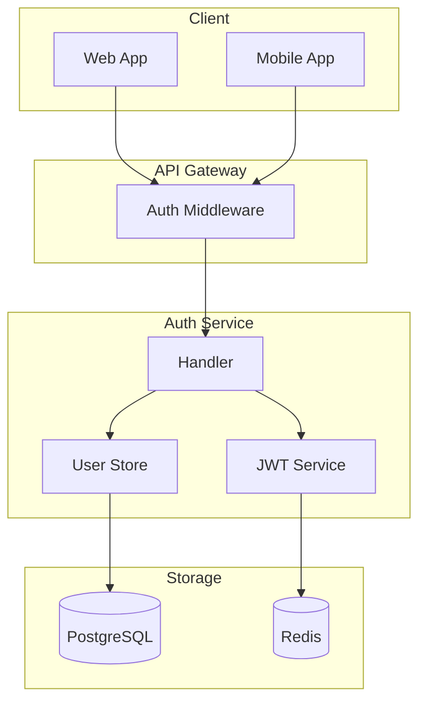
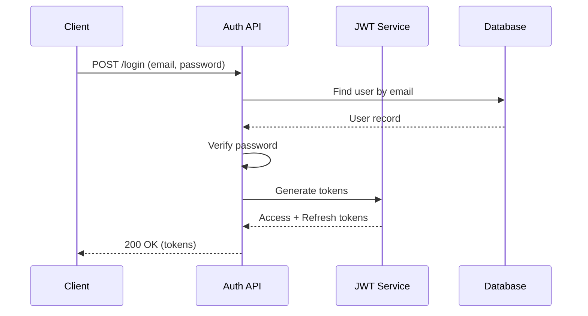

# Phase 5: Auto Docs Generator Skill

> Automatic documentation after implementation

## Purpose

Automatically generate API documentation, changelogs, architecture diagrams, etc.
for completed features to reduce documentation burden and maintain consistency.

## Usage Scenarios

```bash
# Generate docs for specific feature
> /generate-docs user-auth

# Generate API docs only
> /generate-docs user-auth --api-only

# Update CHANGELOG
> /generate-docs --changelog

# Regenerate all docs
> /generate-docs --all
```

## Document Types

### 1. API Documentation

```yaml
source: Extract from code
  - HTTP handler functions
  - OpenAPI/Swagger annotations
  - Request/response type definitions

output: docs/api/{feature}/README.md
```

**Example Output:**

```markdown
# User Auth API

## Endpoints

### POST /api/auth/signup

Signup API

**Request Body:**
```json
{
  "email": "user@example.com",
  "password": "securePassword123"
}
```

**Response:**
```json
{
  "id": 1,
  "email": "user@example.com",
  "created_at": "2024-01-15T10:00:00Z"
}
```

**Error Codes:**
| Code | Description |
|------|-------------|
| 400 | Invalid email format |
| 409 | Email already exists |

---

### POST /api/auth/login
...
```

### 2. CHANGELOG

```yaml
source:
  - Git commit history
  - Design documents (00_OVERVIEW.md)
  - PR descriptions

output: CHANGELOG.md (append to existing file)
```

**Example Output:**

```markdown
## [Unreleased]

### Added
- User authentication system with JWT tokens
  - Signup endpoint (`POST /api/auth/signup`)
  - Login endpoint (`POST /api/auth/login`)
  - Token refresh endpoint (`POST /api/auth/refresh`)
- Session management with Redis

### Changed
- Updated database schema with users table

### Security
- Implemented bcrypt password hashing
- Added rate limiting for auth endpoints
```

### 3. Architecture Diagram

```yaml
source:
  - Design documents (System Architecture section)
  - Code structure analysis

output: docs/architecture/{feature}.md (Mermaid diagrams)
```

**Example Output:**

```markdown
# User Auth Architecture

## Component Diagram



## Sequence Diagram - Login Flow


```

### 4. Type/Model Documentation

```yaml
source:
  - Go struct, TypeScript interface
  - Database schema

output: docs/models/{feature}.md
```

**Example Output:**

```markdown
# User Auth Models

## User

| Field | Type | Description |
|-------|------|-------------|
| id | int64 | Primary key |
| email | string | Unique email address |
| password_hash | string | Bcrypt hashed password |
| created_at | time.Time | Creation timestamp |
| updated_at | time.Time | Last update timestamp |

## Session

| Field | Type | Description |
|-------|------|-------------|
| id | int64 | Primary key |
| user_id | int64 | Foreign key to users |
| refresh_token | string | JWT refresh token |
| expires_at | time.Time | Token expiration |
```

### 5. Usage Guide

```yaml
source:
  - Design documents
  - API documentation
  - Code examples

output: docs/guides/{feature}.md
```

**Example Output:**

```markdown
# User Auth Usage Guide

## Quick Start

### 1. Sign Up

```bash
curl -X POST http://localhost:8080/api/auth/signup \
  -H "Content-Type: application/json" \
  -d '{"email": "user@example.com", "password": "secure123"}'
```

### 2. Login

```bash
curl -X POST http://localhost:8080/api/auth/login \
  -H "Content-Type: application/json" \
  -d '{"email": "user@example.com", "password": "secure123"}'
```

Response:
```json
{
  "access_token": "eyJhbG...",
  "refresh_token": "eyJhbG...",
  "expires_in": 900
}
```

### 3. Use Access Token

```bash
curl http://localhost:8080/api/protected \
  -H "Authorization: Bearer eyJhbG..."
```
```

## File Structure

```
skills/generate-docs/
├── SKILL.md              # Skill definition
├── config.yaml           # Generation settings
├── extractors/
│   ├── api.md            # API extraction guide
│   ├── types.md          # Type extraction guide
│   └── changelog.md      # Changelog rules
└── templates/
    ├── api.md            # API doc template
    ├── changelog.md      # CHANGELOG template
    ├── architecture.md   # Architecture template
    ├── models.md         # Model doc template
    └── guide.md          # Guide template
```

## config.yaml Schema

```yaml
# generate-docs skill settings

output:
  base_path: "docs"
  api_path: "docs/api"
  architecture_path: "docs/architecture"
  guides_path: "docs/guides"
  models_path: "docs/models"

generators:
  api:
    enabled: true
    format: "markdown"      # markdown | openapi
    include_examples: true
    include_errors: true

  changelog:
    enabled: true
    format: "keepachangelog"  # keepachangelog | conventional
    auto_categorize: true     # Auto-categorize as Added, Changed, Fixed

  architecture:
    enabled: true
    diagram_format: "mermaid"
    include_sequence: true
    include_component: true

  models:
    enabled: true
    include_validation: true
    include_examples: true

  guide:
    enabled: true
    include_curl: true
    include_sdk: false        # Include SDK examples

# Language-specific settings
language:
  go:
    handler_pattern: "func.*Handler.*http.ResponseWriter"
    struct_pattern: "type\\s+(\\w+)\\s+struct"
  typescript:
    handler_pattern: "export.*async.*Request.*Response"
    interface_pattern: "export interface"

# Source paths
sources:
  code: "internal"
  plans: "docs/plans"
```

## SKILL.md Definition

```yaml
---
name: generate-docs
description: Generate API docs, changelog, architecture diagrams from code
allowed-tools: Read, Write, Glob, Grep, Bash, Task
---
```

## Execution Flow

```
┌─────────────────┐
│ /generate-docs  │
│   user-auth     │
└────────┬────────┘
         │
         ▼
┌─────────────────┐
│ 1. Source       │
│    Analysis     │
│ - Design docs   │
│ - Impl code     │
│ - Git history   │
└────────┬────────┘
         │
         ▼
┌─────────────────┐
│ 2. Information  │
│    Extraction   │
│ - API endpoints │
│ - Types/Models  │
│ - Changes       │
└────────┬────────┘
         │
         ▼
┌─────────────────┐
│ 3. Template     │
│    Application  │
│ - Generate docs │
│ - Diagrams      │
└────────┬────────┘
         │
         ▼
┌─────────────────┐
│ 4. File Output  │
│ - docs/api/     │
│ - CHANGELOG.md  │
│ - docs/arch/    │
└─────────────────┘
```

## Output Example

```
## 📚 Documentation Generated

### user-auth Feature

📁 Generated Files:
├── docs/api/user-auth/README.md          ✓ API Documentation
├── docs/architecture/user-auth.md        ✓ Architecture Diagrams
├── docs/models/user-auth.md              ✓ Data Models
├── docs/guides/user-auth.md              ✓ Usage Guide
└── CHANGELOG.md                          ✓ Updated

### Summary
- 4 API endpoints documented
- 3 data models documented
- 2 architecture diagrams generated
- 1 changelog entry added

### Preview

#### API Endpoints
- POST /api/auth/signup
- POST /api/auth/login
- POST /api/auth/refresh
- POST /api/auth/logout

#### New Changelog Entry
```
## [1.2.0] - 2024-01-18
### Added
- User authentication system with JWT
```
```

## Workflow Integration

```
/plan-feature     /init-impl      Development      /review        /generate-docs
     │                │             │              │                 │
     │                │             │              │                 │
     ▼                ▼             ▼              ▼                 ▼
  Design docs    →   Checklist  →  Code writing →  Quality rev. → Auto doc gen
     │                                                              │
     └──────────────────────────────────────────────────────────────┘
                        Document ↔ Code Consistency
```

## Extensibility

- **OpenAPI Output**: Generate Swagger UI compatible docs
- **SDK Generation**: Auto-generate SDK code from API docs
- **Multi-language Support**: Auto-translate documentation
- **Versioning**: Maintain docs per API version
- **Change Detection**: Notify when code changes require doc updates
