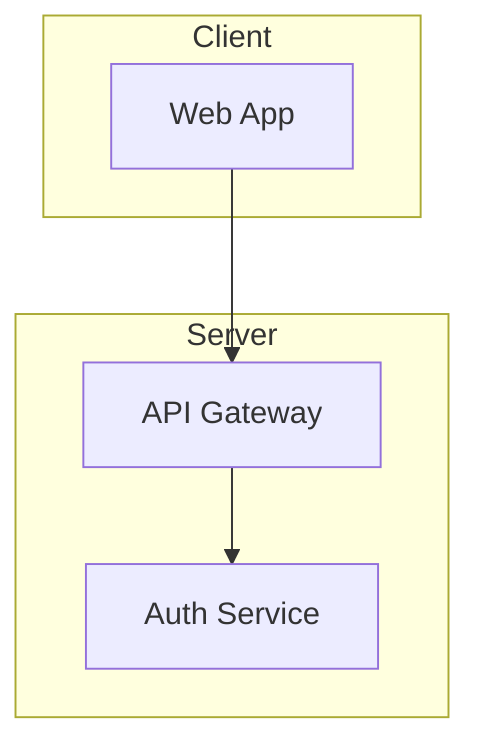
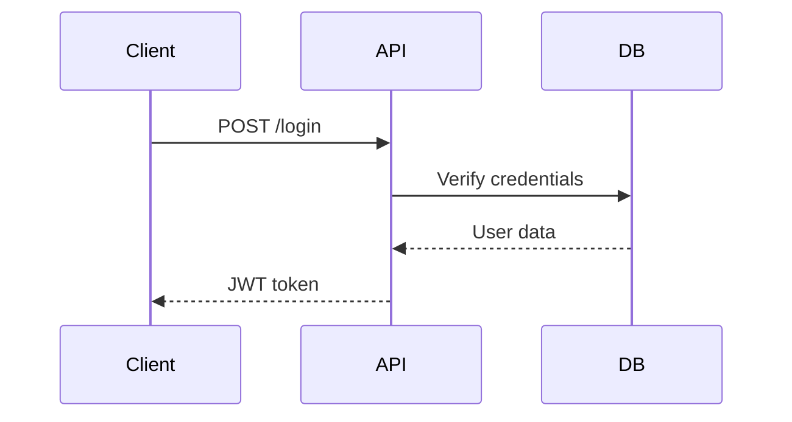

# Generate Docs Skill

Automatically generates documentation from code and design documents after implementation is complete.

## When to Use

- After completing a feature implementation
- When preparing for release
- Updating API documentation
- Creating architecture diagrams

## Usage

```bash
# Generate all docs for a feature
> /generate-docs user-auth

# Generate specific doc type
> /generate-docs user-auth --api-only
> /generate-docs user-auth --changelog
> /generate-docs user-auth --architecture

# Update project-wide docs
> /generate-docs --all
```

## Configuration File

Skill settings are managed in `config.yaml` in the same folder.

## Execution Flow

```
1. Load Context          → Read design docs and implemented code
       ↓
2. Extract Information   → Parse code for APIs, types, etc.
       ↓
3. Generate API Docs     → Create endpoint documentation
       ↓
4. Update Changelog      → Add new entries
       ↓
5. Create Diagrams       → Generate Mermaid diagrams
       ↓
6. Write Files           → Output documentation files
```

## Generated Documents

### 1. API Documentation

Location: `docs/api/{feature}/README.md`

Includes:
- Endpoint list with methods
- Request/response schemas
- Error codes
- Usage examples

### 2. Changelog

Location: `CHANGELOG.md` (project root)

Format: [Keep a Changelog](https://keepachangelog.com/)

Categories:
- Added - New features
- Changed - Changes in existing functionality
- Deprecated - Soon-to-be removed features
- Removed - Removed features
- Fixed - Bug fixes
- Security - Vulnerability fixes

### 3. Architecture Diagrams

Location: `docs/architecture/{feature}.md`

Includes:
- Component diagram (Mermaid)
- Sequence diagrams for key flows
- Data flow diagrams

### 4. Data Models

Location: `docs/models/{feature}.md`

Includes:
- Type definitions
- Database schemas
- Validation rules

### 5. Usage Guide

Location: `docs/guides/{feature}.md`

Includes:
- Quick start
- Code examples (curl, SDK)
- Configuration options

## Output Format

### Successful Generation

```
## 📚 Documentation Generated: user-auth

### Files Created/Updated

📁 Generated Files:
├── docs/api/user-auth/README.md       ✓ Created
├── docs/architecture/user-auth.md     ✓ Created
├── docs/models/user-auth.md           ✓ Created
├── docs/guides/user-auth.md           ✓ Created
└── CHANGELOG.md                       ✓ Updated

### Summary

| Type | Items |
|------|-------|
| API Endpoints | 4 documented |
| Data Models | 2 documented |
| Diagrams | 3 generated |
| Changelog Entries | 1 added |

### Preview

#### API Endpoints
- `POST /api/auth/signup` - User registration
- `POST /api/auth/login` - User login
- `POST /api/auth/refresh` - Token refresh
- `POST /api/auth/logout` - User logout

#### New Changelog Entry
```
## [1.2.0] - 2024-01-18

### Added
- User authentication system with JWT tokens
- Login, signup, and token refresh endpoints
- Session management with Redis
```

### Next Steps
- Review generated documentation
- Commit documentation changes
- Consider publishing to docs site
```

## Extraction Rules

### API Endpoints

Detected from:
- HTTP handler functions
- Route definitions
- OpenAPI/Swagger annotations

### Data Models

Detected from:
- Struct/class definitions
- Database migrations
- Type definitions

### Changelog Entries

Generated from:
- Git commit messages since last tag
- Design document summary
- PR descriptions

## Diagram Generation

Uses Mermaid syntax for:

### Component Diagram



### Sequence Diagram



## Options

| Option | Description |
|--------|-------------|
| `--api-only` | Generate only API documentation |
| `--changelog` | Update only changelog |
| `--architecture` | Generate only architecture diagrams |
| `--models` | Generate only model documentation |
| `--guides` | Generate only usage guides |
| `--all` | Generate docs for all features |
| `--dry-run` | Preview without writing files |

## On Completion (Slack Notification)

After documentation generation, send Slack notification if configured:

1. **Check webhook configuration:**
   ```bash
   WEBHOOK=$(grep 'webhook_url:' skills/slack-notify/config.yaml 2>/dev/null | sed 's/.*"\(.*\)"/\1/')
   ```

2. **If webhook is configured** (not empty and doesn't contain "YOUR"):
   ```bash
   curl -s -X POST "$WEBHOOK" \
     -H "Content-Type: application/json" \
     -d '{
       "blocks": [
         {"type": "header", "text": {"type": "plain_text", "text": "📚 Documentation Generated", "emoji": true}},
         {"type": "section", "text": {"type": "mrkdwn", "text": "Documentation for *{feature_name}* has been created."}},
         {"type": "section", "fields": [
           {"type": "mrkdwn", "text": "*Files:*\n{file_count} generated"},
           {"type": "mrkdwn", "text": "*Types:*\nAPI, Models, Architecture"}
         ]},
         {"type": "context", "elements": [{"type": "mrkdwn", "text": "Next: Review and commit documentation"}]}
       ]
     }' > /dev/null 2>&1 || true
   ```

3. **Continue with normal completion output** (notification failure should not block)

## Related Skills

- `/review` → Review should pass before generating docs
- `/status` → Check implementation is complete
- `/plan-feature` → Design docs used as input
