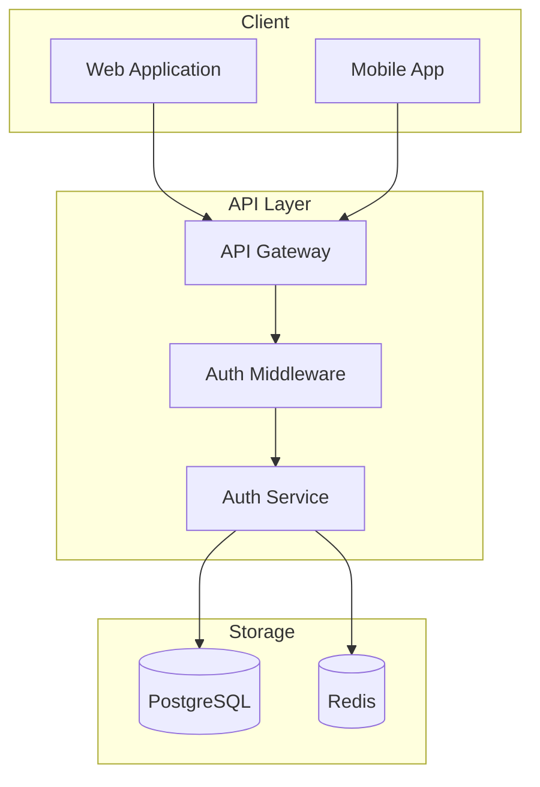
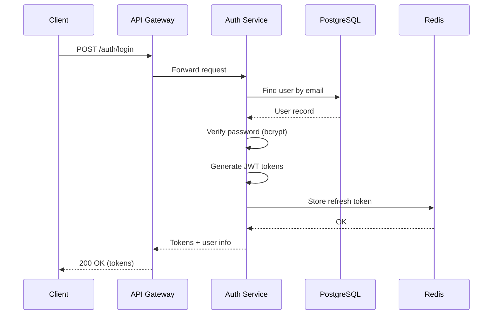
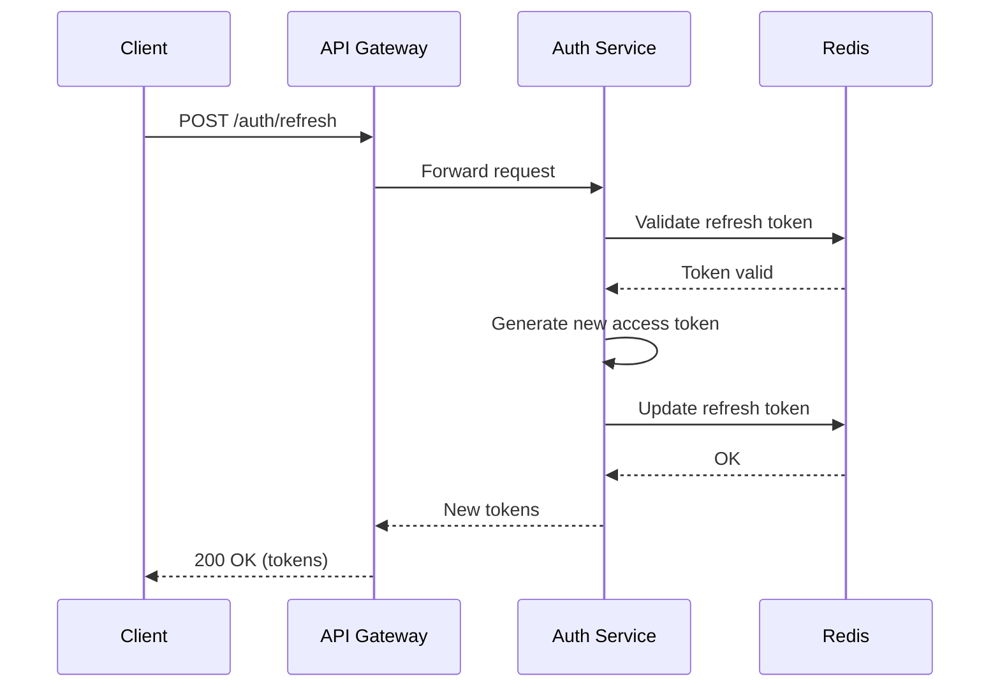
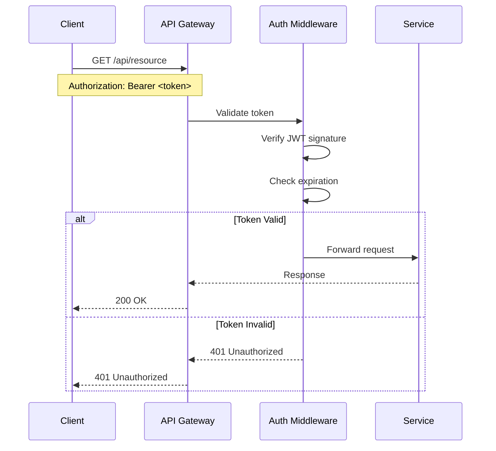
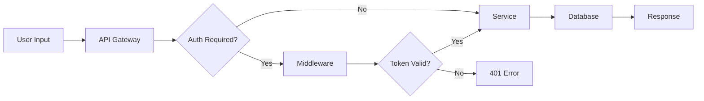

# Architecture Documentation Template

Use this template when generating architecture diagrams.

## Structure

```markdown
# {FEATURE_NAME} Architecture

> {BRIEF_DESCRIPTION}

## Overview

{OVERVIEW_TEXT}

## Component Diagram

```mermaid
graph {DIRECTION}
    subgraph {SUBGRAPH_NAME}
        {COMPONENT_DEFINITIONS}
    end

    {CONNECTIONS}
```

## Sequence Diagrams

### {FLOW_NAME}

```mermaid
sequenceDiagram
    {PARTICIPANTS}

    {SEQUENCE_STEPS}
```

## Data Flow

```mermaid
flowchart LR
    {DATA_FLOW_NODES}
```

## Components

| Component | Responsibility | Dependencies |
|-----------|---------------|--------------|
{FOR_EACH_COMPONENT}
| {NAME} | {RESPONSIBILITY} | {DEPENDENCIES} |
{END_FOR}

## Technology Stack

| Layer | Technology | Purpose |
|-------|------------|---------|
{FOR_EACH_TECH}
| {LAYER} | {TECH} | {PURPOSE} |
{END_FOR}
```

## Example Output

```markdown
# User Auth Architecture

> JWT-based authentication system with session management

## Overview

The authentication system provides secure user authentication using JWT tokens.
It consists of a stateless API layer backed by PostgreSQL for user data and Redis
for session/token management.

## Component Diagram



## Sequence Diagrams

### User Login Flow



### Token Refresh Flow



### Protected Resource Access



## Data Flow



## Components

| Component | Responsibility | Dependencies |
|-----------|---------------|--------------|
| API Gateway | Request routing, rate limiting | - |
| Auth Middleware | Token validation | Redis |
| Auth Service | User management, token generation | PostgreSQL, Redis |
| User Store | User CRUD operations | PostgreSQL |
| Token Manager | JWT generation, validation | Redis |

## Technology Stack

| Layer | Technology | Purpose |
|-------|------------|---------|
| API | Go + Chi Router | HTTP handling |
| Authentication | JWT (RS256) | Stateless auth |
| Password | bcrypt | Secure hashing |
| Database | PostgreSQL | User data |
| Cache | Redis | Sessions, tokens |
| Validation | go-playground/validator | Input validation |
```
