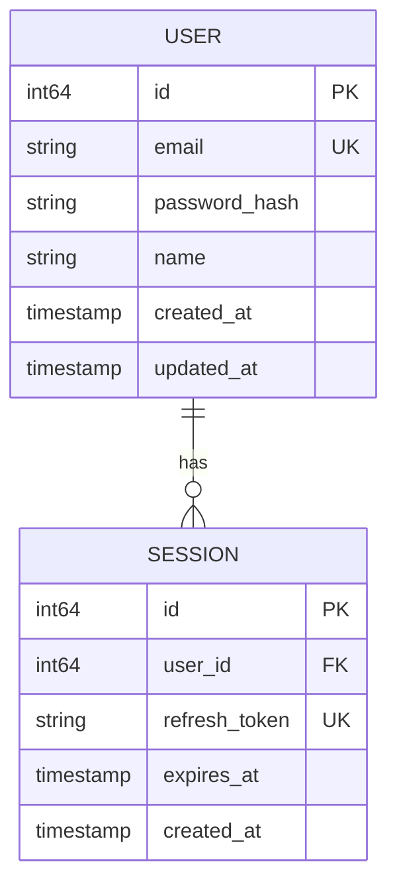

# Models Documentation Template

Use this template when generating data model documentation.

## Structure

```markdown
# {FEATURE_NAME} Data Models

> {BRIEF_DESCRIPTION}

## Overview

{OVERVIEW_TEXT}

## Entity Relationship Diagram

```mermaid
erDiagram
    {ER_DIAGRAM}
```

## Models

{FOR_EACH_MODEL}
### {MODEL_NAME}

{DESCRIPTION}

#### Fields

| Field | Type | Required | Description |
|-------|------|----------|-------------|
{FOR_EACH_FIELD}
| `{NAME}` | {TYPE} | {REQUIRED} | {DESCRIPTION} |
{END_FOR}

#### Validation Rules

{FOR_EACH_VALIDATION}
- `{FIELD}`: {RULE}
{END_FOR}

#### Example

```json
{JSON_EXAMPLE}
```

{IF_DB_SCHEMA}
#### Database Schema

```sql
{SQL_SCHEMA}
```
{END_IF}

---
{END_FOR}

## Enums

{FOR_EACH_ENUM}
### {ENUM_NAME}

| Value | Description |
|-------|-------------|
{FOR_EACH_VALUE}
| `{VALUE}` | {DESCRIPTION} |
{END_FOR}
{END_FOR}
```

## Example Output

```markdown
# User Auth Data Models

> Data models for the authentication system

## Overview

The authentication system uses two primary models: `User` for account information
and `Session` for managing authentication sessions and refresh tokens.

## Entity Relationship Diagram



## Models

### User

Represents a registered user account.

#### Fields

| Field | Type | Required | Description |
|-------|------|----------|-------------|
| `id` | int64 | Yes | Unique identifier (auto-generated) |
| `email` | string | Yes | User's email address (unique) |
| `password_hash` | string | Yes | Bcrypt hashed password |
| `name` | string | No | Display name |
| `role` | UserRole | Yes | User role (default: user) |
| `email_verified` | bool | Yes | Email verification status |
| `created_at` | timestamp | Yes | Account creation time |
| `updated_at` | timestamp | Yes | Last update time |

#### Validation Rules

- `email`: Valid email format, max 255 characters
- `password`: Min 8 characters, must contain letter and number
- `name`: Max 100 characters, alphanumeric and spaces only

#### Example

```json
{
  "id": 1,
  "email": "user@example.com",
  "name": "John Doe",
  "role": "user",
  "email_verified": true,
  "created_at": "2024-01-15T10:00:00Z",
  "updated_at": "2024-01-15T10:00:00Z"
}
```

#### Database Schema

```sql
CREATE TABLE users (
    id BIGSERIAL PRIMARY KEY,
    email VARCHAR(255) UNIQUE NOT NULL,
    password_hash VARCHAR(255) NOT NULL,
    name VARCHAR(100),
    role VARCHAR(20) NOT NULL DEFAULT 'user',
    email_verified BOOLEAN NOT NULL DEFAULT FALSE,
    created_at TIMESTAMP WITH TIME ZONE DEFAULT CURRENT_TIMESTAMP,
    updated_at TIMESTAMP WITH TIME ZONE DEFAULT CURRENT_TIMESTAMP
);

CREATE INDEX idx_users_email ON users(email);
CREATE INDEX idx_users_role ON users(role);
```

---

### Session

Represents an active authentication session with refresh token.

#### Fields

| Field | Type | Required | Description |
|-------|------|----------|-------------|
| `id` | int64 | Yes | Unique identifier (auto-generated) |
| `user_id` | int64 | Yes | Reference to user |
| `refresh_token` | string | Yes | JWT refresh token (unique) |
| `user_agent` | string | No | Client user agent |
| `ip_address` | string | No | Client IP address |
| `expires_at` | timestamp | Yes | Token expiration time |
| `created_at` | timestamp | Yes | Session creation time |

#### Validation Rules

- `refresh_token`: Valid JWT format
- `expires_at`: Must be in the future
- `user_id`: Must reference existing user

#### Example

```json
{
  "id": 1,
  "user_id": 1,
  "refresh_token": "eyJhbGciOiJSUzI1NiIsInR5cCI6IkpXVCJ9...",
  "user_agent": "Mozilla/5.0 (Macintosh; Intel Mac OS X 10_15_7)",
  "ip_address": "192.168.1.1",
  "expires_at": "2024-01-22T10:00:00Z",
  "created_at": "2024-01-15T10:00:00Z"
}
```

#### Database Schema

```sql
CREATE TABLE sessions (
    id BIGSERIAL PRIMARY KEY,
    user_id BIGINT NOT NULL REFERENCES users(id) ON DELETE CASCADE,
    refresh_token VARCHAR(500) UNIQUE NOT NULL,
    user_agent VARCHAR(500),
    ip_address VARCHAR(45),
    expires_at TIMESTAMP WITH TIME ZONE NOT NULL,
    created_at TIMESTAMP WITH TIME ZONE DEFAULT CURRENT_TIMESTAMP
);

CREATE INDEX idx_sessions_user_id ON sessions(user_id);
CREATE INDEX idx_sessions_refresh_token ON sessions(refresh_token);
CREATE INDEX idx_sessions_expires_at ON sessions(expires_at);
```

---

## Enums

### UserRole

User permission levels.

| Value | Description |
|-------|-------------|
| `admin` | Full system access |
| `moderator` | Content management access |
| `user` | Standard user access |
| `guest` | Limited read-only access |

### TokenType

Types of authentication tokens.

| Value | Description |
|-------|-------------|
| `access` | Short-lived access token (15 min) |
| `refresh` | Long-lived refresh token (7 days) |
| `reset` | Password reset token (1 hour) |
| `verify` | Email verification token (24 hours) |
```
